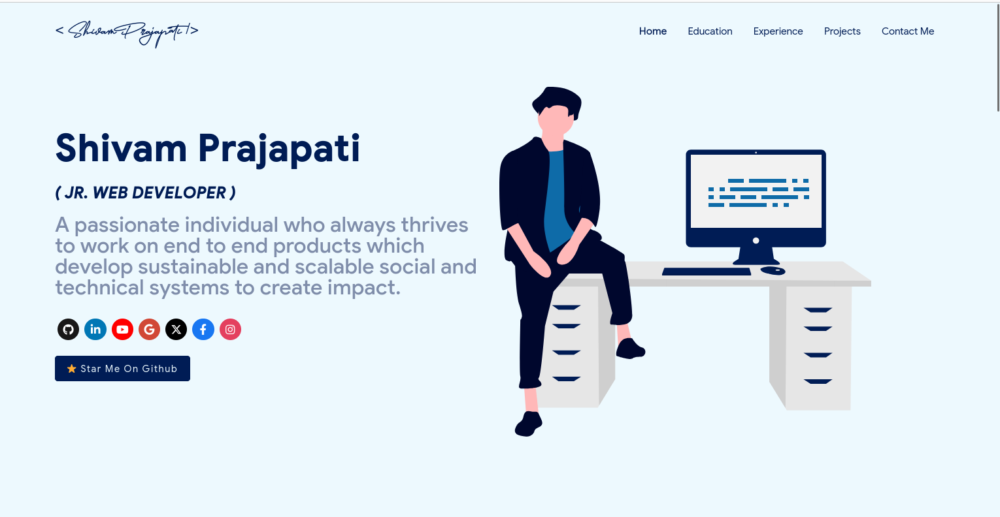

# Quad Pulse Portfolio

Welcome to my personal portfolio! This project showcases my web development skills, including my work in React, JavaScript, and other web technologies. The portfolio is dynamic, with sections like Home, Education, Experience, Projects, Contact Me, Resume, Skills, Certifications, and more. The content is powered by a JSON file for easy updates and management.

## Live Portfolio

You can view the live version of my portfolio [here](https://personalportfolio-5tub.onrender.com/contact).

## Features
<p align="center"> 
    </img>
</p>

- **Home**: A brief introduction about myself.
- **Education**: Details about my academic background.
- **Experience**: Professional experience and roles.
- **Projects**: A list of my significant projects with live links.
- **Contact Me**: Ways to get in touch with me (email, phone).
- **Resume**: A link to my downloadable resume.
- **Skills**: List of my technical skills.
- **Certifications**: Information about certifications I’ve earned.
- **More**: Additional custom sections can be added as needed.


To view a live example, **[click here](https://ashutosh1919.github.io/)**

# Clone and Use 📋
## Tech Stack

- **Frontend**: React.js, CSS
- **Tools**: Node.js, npm
- **Other**: JSON (for content management)

## Installation

To run this project locally on your machine, follow the steps below:

### 1. Clone the repository

```bash
git clone https://github.com/yourusername/quad_pulse_my_portfolio.git
cd quad_pulse_my_portfolio

### How to change the icons on homepage under what i do section?

1. This section pulls data from `skills` in portfolio.js file.
2. Visit this website:fontawesome
3. Search for the skill you are looking to add.
4. Select the icon of your choice.
5. Copy the text beside **Selected Icon** and replace it with `fontAwesomeClassName` of that particular softwareSkill.

#### How to use custom images instead of Iconify Icons?

1. Add a valid image file into the `public/skills` folder
2. Insert the image name into the `imageSrc` attribute of the particular softwareSkill
3. Remove the `fontAwesomeClassName` property or leave it empty because it takes precedence over `imageSrc`
4. Add custom styling to the `img` using the `style` Property
